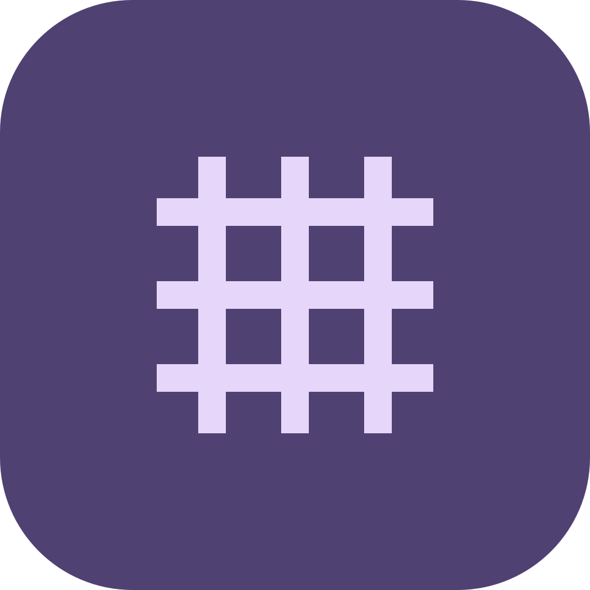

<div align="center">



# Stitches

_A free, open-source cross-stitch pattern editor for macOS, Windows, iOS and Android_

[](https://github.com/scme0/Stitches/actions/workflows/ci.yml)
[](CHANGELOG.md)
[](https://flutter.dev)
[](LICENSE)
[](https://github.com/scme0/Stitches/stargazers)


_Built with the assistance of [Claude Code](https://claude.ai/claude-code)_

</div>

---

| | | |
|:---|:---|:---|
| 🪡 **Full stitch toolkit** — full, half, quarter, backstitch, fill | 🎨 **~300 DMC colours** — with Anchor cross-reference | ☁️ **Google Drive sync** — auto-save across devices |
| ✂️ **Snippets & sprite importer** — reusable motifs from pixel art | ✏️ **Apple Pencil** — hover preview, double-tap erase | 📄 **PDF scanner** *(beta)* — convert printed charts to patterns |

## 📺 See it in action

> Videos coming soon — recordings in progress. Each `▶` block below will contain an MP4 demo.
>
> **To add a video:** record an MP4, drag it into any GitHub issue/PR comment box to get a CDN URL, then replace `VIDEO_URL_HERE` in the relevant block below.

<details>
<summary>▶ Core drawing loop (~20s)</summary>

<!--
Shot list:
1. Start on a blank new pattern (30×30)
2. Draw a row of full stitches in one colour
3. Switch to a second colour, draw half stitches / and \
4. Add a backstitch outline — tap two grid intersections
5. Undo twice, redo once
6. Pinch/scroll to zoom in so stitches fill the frame
-->

<video src="VIDEO_URL_HERE" controls width="100%"></video>

</details>

<details>
<summary>▶ Layers & blend modes (~25s)</summary>

<!--
Shot list:
1. Open a pattern with a base layer already drawn
2. Add a new layer, rename it "glow"
3. Draw some stitches on top in a bright colour
4. Toggle layer visibility on/off
5. Change blend mode to Add — show the glow composite
6. Reduce layer opacity to ~60%
7. Switch to stitch mode briefly to show the composite palette
-->

<video src="VIDEO_URL_HERE" controls width="100%"></video>

</details>

<details>
<summary>▶ Select, copy & transform (~20s)</summary>

<!--
Shot list:
1. Rubber-band select a distinct motif region
2. Tap Copy
3. Paste — ghost follows cursor
4. Flip horizontal
5. Rotate 90° CW
6. Stamp onto a new area of the canvas
-->

<video src="VIDEO_URL_HERE" controls width="100%"></video>

</details>

<details>
<summary>▶ Snippets (~30s)</summary>

<!--
Shot list:
1. Select a small motif, tap "Save as snippet", name it
2. Open the snippets panel (slide-up sheet)
3. Tap the snippet — enters paste mode
4. Stamp it 3–4 times across the canvas
5. Long-press the snippet → Edit → open snippet editor
6. Draw one extra stitch in the editor, close
7. Back on main canvas — stamp the updated snippet
-->

<video src="VIDEO_URL_HERE" controls width="100%"></video>

</details>

<details>
<summary>▶ Sprite sheet importer (~30s)</summary>

<!--
Shot list:
1. Open a pixel-art sprite sheet (retro game characters work well)
2. Crop mode: drag a rectangle around one character
3. Watch the DMC colour-matching conversion
4. Drag the palette simplification slider — show colours merging
5. Tap "Add to Snippets"
6. Switch back to main canvas, open snippets panel, stamp it
-->

<video src="VIDEO_URL_HERE" controls width="100%"></video>

</details>

<details>
<summary>▶ Stitch mode (~20s)</summary>

<!--
Shot list:
1. Open a colourful finished pattern in design mode
2. Tap the "Stitch Mode" FAB — UI simplifies
3. Tap one colour in the palette — all other stitches dim to grey
4. Tap a different colour — focus switches
5. Show the keep-screen-on toggle
6. Tap "Exit Stitch Mode" to return
-->

<video src="VIDEO_URL_HERE" controls width="100%"></video>

</details>

<details>
<summary>▶ Apple Pencil on iPad (~20s)</summary>

<!--
Shot list:
1. Hover pencil over canvas — preview cell highlights before touching
2. Draw a row of stitches with the pencil
3. Double-tap pencil barrel — switches to erase mode (show indicator change)
4. Double-tap again — back to draw
5. In paste mode: hover pencil to position ghost, tap finger to stamp
-->

<video src="VIDEO_URL_HERE" controls width="100%"></video>

</details>

<details>
<summary>▶ Google Drive sync (~15s)</summary>

<!--
Shot list:
1. Show Drive connected state in the toolbar (sync indicator)
2. Make a small edit — watch the auto-save indicator pulse
3. Open the Drive folder picker briefly
4. Show the same file listed in the home screen Drive section
-->

<video src="VIDEO_URL_HERE" controls width="100%"></video>

</details>

<details>
<summary>▶ PDF scanner — <em>beta</em> (~35s)</summary>

<!--
Shot list:
1. Open a cross-stitch chart PDF
2. Select the page containing the grid
3. Crop the grid bounds (auto-detect, tweak handles)
4. Enter stitch count dimensions
5. Tap a few cells for each symbol type, assign DMC codes
6. Tap "Scan" — watch cells fill in
7. Review a flagged cell, reassign it
8. Show the finished pattern
-->

<video src="VIDEO_URL_HERE" controls width="100%"></video>

> ⚠️ *Works best on clean, high-contrast charts. Full-stitch extraction only in this release.*

</details>

<details>
<summary>▶ Stitch demonstration — <em>beta</em> (~25s)</summary>

<!--
Shot list:
1. Open a small finished pattern
2. Tap the stitch demo button
3. Animation plays — needle traces the stitch order thread by thread
4. Show colour-coded passes (front/back)
5. Tap a different start cell — animation re-plans
6. Export GIF button briefly visible
-->

<video src="VIDEO_URL_HERE" controls width="100%"></video>

> ⚠️ *Beta — some complex patterns may produce suboptimal stitch paths.*

</details>

<details>
<summary>📖 Full feature reference</summary>

## Features

### Pattern editing
- **Pattern canvas** — draw full stitches, half stitches (forward `/` and backward `\`), quarter stitches, and backstitches on a scalable grid
- **Canvas layers** — named layers with per-layer visibility, opacity, lock, and blend mode (Normal / Screen / Add) toggles; layers panel in the right sidebar; stitches scoped to the active layer; drag to reorder; organise layers into collapsible named groups with master visibility and lock controls; add Layer / Group buttons appear inline below the list; layers collapse into a single composite view for printing or export
- **DMC / Anchor color palette** — searchable library of ~300 DMC thread colors with Anchor cross-reference numbers; toggle between DMC and Anchor codes in Settings; threads enter the palette automatically on first stitch and are pruned when the last stitch is erased
- **Symbols** — every palette thread and composite thread gets a unique symbol from a curated pool of ~175 UTF-8 characters; symbols are stable across save/reload and opacity changes; long-press any thread row in the Colours panel to open the symbol picker — choose from the grid or type any custom UTF-8/16 character directly
- **Undo / redo** — full history stack (up to 200 steps) covering both canvas stitches and palette colour assignments; double-tap to undo on touch devices
- **Zoom & pan** — pinch-to-zoom, scroll-wheel zoom, drag to pan, middle-click drag to pan; zoom range 0.1×–20×
- **Resize canvas** — adjust pattern dimensions after creation
- **Reference image overlay** — import a photo as a semi-transparent overlay on the canvas to trace from; adjustable opacity

### Tools
- Full stitch
- Half stitch (forward / backward)
- Quarter stitch (any corner)
- Half-cell cross / petit point
- Backstitch (tap two grid intersections)
- Navigate (pan without drawing)
- **Erase** — size picker 1–10 (erases an N×N box of cells centred on the cursor); hover preview shows the exact cells that will be erased; **fill erase** sub-option flood-erases all connected full stitches of the same colour `[9]`
- Color picker — samples a stitch's thread colour; layer-aware (picks the topmost visible stitch at the tapped cell)
- Selection (rubber-band, copy, paste, delete regions); paste opacity slider blends colours with the canvas via CIE Lab nearest-DMC lookup; **Canvas mode** toggle collects stitches from all visible layers instead of only the active layer — applies to copy, move, delete, flip, rotate, and save-as-snippet
- **Flip & rotate** — flip or rotate the active selection, paste clipboard, or full canvas; available in the toolbar and via keyboard shortcuts
- **Fill colour** — 8-connected flood fill; fills all connected cells of the same colour (or empty) with the selected thread `[8]`

### Snippets
- **Per-pattern snippet library** — save any selection or clipboard as a named snippet stored inside the `.stitches` file
- **Snippet panel** — slide-up panel showing all snippets as thumbnails; tap to enter paste mode, long-press or tap ⋮ for rename / resize / flip / rotate / edit / delete
- **Snippet editor** — full canvas editor for drawing a snippet from scratch, with preset sizes (8×8 up to 64×64) or a custom size; paste any other snippet from the library directly onto the canvas via the toolbar; block mode toggle in the AppBar with visual active state
- **Multi-palette snippets** — each snippet can hold multiple named colour palettes; switch between palettes via the Palettes tab in the right sidebar or the palette dots in the snippet panel; palettes use positional slot mapping so swapping applies consistently across the whole design; new colours drawn on the canvas propagate to all palettes automatically
- **Save as snippet** — one-tap save of the current selection or paste clipboard to the snippet library; unnamed by default, rename anytime; respects Canvas mode to capture stitches from all visible layers in one snippet
- **Sprite sheet importer** — open any sprite sheet image and crop a region; pixel colours matched to nearest DMC thread via CIE Lab colour space; define multiple colour palettes by selecting colour-strip regions on the image; background pixels outside the palette are dropped automatically; output saved directly as a snippet; available on tablet and desktop

### Files & workspace
- **File format** — patterns saved as `.stitches` files (YAML internally, gzip-compressed; backwards-compatible with older uncompressed files)
- **Folder workspace** — open a local folder as a workspace with a file tree sidebar
- **Google Drive sync** — connect a Google Drive account; patterns auto-save and sync in the background
- **Recent files** — quick access to recently opened files and folders, including Drive items; Drive items show a warning and are unclickable when not signed in or signed in as a different account

### PDF pattern scanner *(beta)*
Convert a printed cross-stitch chart PDF into an editable pattern without any AI or internet connection required.

1. **Page selection** — choose which PDF pages contain the legend and the stitch grid
2. **Grid crop** — auto-detect the grid bounds on each page; adjust manually if needed
3. **Pattern dimensions** — enter the stitch count (cols × rows) for the design
4. **Symbol sampling** — tap one or more cells in the grid for each unique symbol and assign the matching DMC thread code; the app builds reference templates from your samples
5. **Template matching** — every cell is compared against the sampled templates using mean absolute pixel difference; cells with ambiguous matches are flagged for manual review
6. **Review** — tap any flagged cell to reassign it; confirm to finish

The resulting pattern is saved automatically as a `.stitches` file next to the source PDF.

> The scanner works best on clean, high-contrast charts. Backstitches and half-stitches are not extracted (full stitches only in this release).

### Stitch demonstration *(beta)*
- **Animated stitch order** — per-thread step-by-step animation showing exactly how to stitch the pattern, with configurable playback speed
- **Stitch planner** — automatic path planning that determines an efficient stitch order, respecting front/back alternation rules
- **Start cell selection** — tap any cell on the demo canvas to set the stitching start point
- **GIF export** — download the stitch order animation as a GIF file
- **Color-coded passes** — front passes (purple / green), back passes (gold / red / blue) with perpendicular offset rendering so overlapping stitches on the same line are all visible

> The stitch demonstration is in beta. Some pattern shapes may produce incorrect or suboptimal stitch paths.

### View options
- **Block mode** — renders all stitches as solid coloured rectangles instead of X-shapes; half stitches occupy half the cell, quarter stitches a quarter cell. Makes it easy to read the overall colour distribution of a design. Toggle button in the AppBar (highlighted when active) on all canvases; defaults to off per session. In stitch mode, symbols remain visible when zoomed in; in design mode the view stays clean. Block mode state is session-only (not saved to file).
- **Zoom-adaptive rendering** — below a zoom threshold, stitches automatically switch to block rendering; backstitches and grid lines fade out at very low zoom

### Platform & input
- **Multi-platform** — macOS, Windows, iOS, Android
- **Apple Pencil** — hover preview shows the cell under the pencil before touching; double-tap toggles draw/erase mode; opt-in paste mode (Settings → Apple Pencil) lets the pencil position the paste ghost without stamping — a finger tap confirms placement
- **Touch** — rubber-band selection, copy/paste, and pan all work with finger on iPad
- **Stitch mode** — simplified read-only view for stitching from a finished pattern; toggle via a floating action button (bottom-right); keep-screen-on icon toggle in the AppBar; composite thread palette shows the actual blended DMC colours produced by layer opacity and blend-mode settings, each with a unique symbol; tap a colour to focus it — all other stitches dim to grey, including correctly-handled multi-layer blended cells
- **Keyboard shortcuts** — full shortcut set on desktop and in snippet editor (undo, redo, tool switching, modes); `?` opens shortcut reference
- **PDF viewer** — view reference PDFs alongside the pattern canvas
- **Image viewer** — view `.png`, `.jpg`, `.gif`, `.webp`, and other image files inline in the canvas area; click any image in the sidebar to open it, click another to switch instantly
- **Right sidebar** — collapsible panel (collapse state persisted) with tabs: **Layers | Colours** in design mode, **Colours** only in stitch mode, **Palettes | Colours** in the snippet editor; resizable 140–350 px; the Colours tab shows all palette threads with stitch counts, sorted in DMC number order (or Anchor number order when Anchor mode is active), and a Canvas / Layer toggle to switch between the full canvas palette and the active-layer-only palette
- **Resizable file sidebar** — drag the sidebar edge to any width between 160–480 px; width is remembered between sessions
- **Sidebar type filters** — toggle PDF and image visibility in the folder tree independently; settings are persisted; switching a filter off only deselects the currently open item if it is of the filtered type — patterns, PDFs, and images remain open independently

</details>

## 🚀 Getting Started

Requires [Flutter 3.41.4+](https://flutter.dev/docs/get-started/install).

```bash
git clone https://github.com/scme0/Stitches.git
cd Stitches
flutter pub get
./run        # macOS / Linux (or Git Bash on Windows)
./run.ps1    # Windows PowerShell
```

For device-specific targets (`ios`, `android`, `windows`, …) run `./run help`.

## 📋 Changelog

See [CHANGELOG.md](CHANGELOG.md) — generated automatically from [changesets](https://github.com/changesets/changesets).

## Backlog

### Files & sync
- Proton Drive support — **on hold, waiting for SDK to mature** (expected 2026). The E2E encryption stack (OpenPGP/GopenPGP key chains) makes an unofficial implementation risky and fragile. When the official SDK ships: if an OpenAPI spec is available, generate a Dart client and wrap it in a service layer (same pattern as `google_drive_service.dart`); if only native iOS/Android SDKs are provided, consider a Flutter plugin. Plan to publish the Proton Drive integration as a standalone Dart package rather than embedding it in the app.
- Extend supported import/export file types (Pattern Maker `.xsd`, PC Stitch `.pat`, others)

### Engineering
- Better test coverage (unit tests exist for models, stitch logic, and layer behaviour; integration and widget tests not yet written)
- Grid detector tests — `test/grid_detector_test.dart` was removed because the fixture PNGs (`grid_test_lighthouse.png`, `grid_test_anchor.png`) were never committed. To restore: add the fixture images to `test/fixtures/`, restore the test file from git history (`git show HEAD~1:test/grid_detector_test.dart`), and set `_lighthouseExpectedKnown` / `_anchorExpectedKnown` to `true` once expected values are confirmed.
